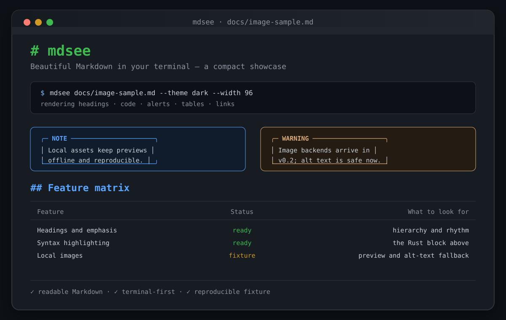

# mdsee Showcase

Beautiful Markdown in your terminal — a compact fixture for checking the parts that make `mdsee` feel like `mdsee`.



> [!NOTE]
> This fixture keeps its image local and repository-owned, so it works without a network connection.

## A small document, many signals

- **Strong text**, *emphasis*, ~~strike~~, and `inline code`
- terminal links: [mdsee on GitHub](https://github.com/kotsutsumi/mdsee)
- task lists for release checks:
  - [x] Markdown parsed
  - [x] Syntax highlighted
  - [x] Tables aligned
  - [ ] Images rendered by the graphics backend

### A command worth previewing

```sh
mdsee docs/image-sample.md --theme dark --width 96
```

```rust
fn main() {
    println!("Beautiful Markdown in your terminal.");
}
```

## Alerts

> [!TIP]
> Use `--plain` when you want stable text for a pipe or a log file.

> [!WARNING]
> The image syntax is intentionally included as a v0.2 fixture. In v0.1, `mdsee` falls back to the image alt text until a graphics backend is enabled.

## Feature matrix

| Feature | Status | What to look for |
| :--- | :---: | ---: |
| Headings and emphasis | ready | hierarchy and rhythm |
| Syntax highlighting | ready | the Rust block above |
| Tables and alerts | ready | alignment and colored borders |
| Local images | fixture | preview image and alt-text fallback |

---

> The goal is simple: readable Markdown, even when the document is opened in a terminal.
